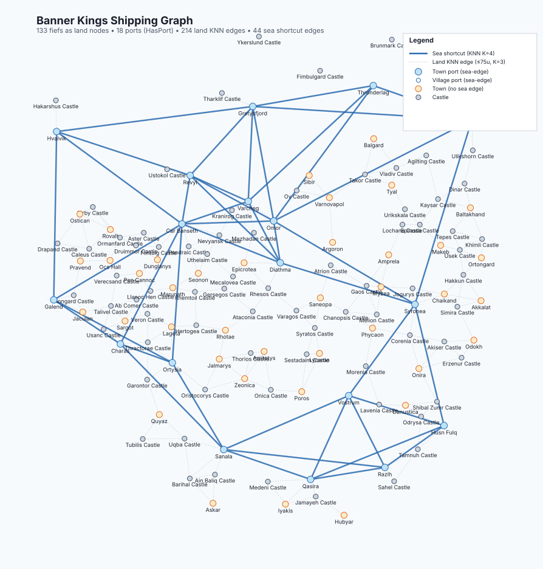

# Shipping & trade

← [Home](Home)

How caravans, AI lord parties, captive caravans, and the player travel
across Calradia under BK Redux. The trade graph is an explicit topology
with adaptive risk weighting and a single unified graph covering both
**sea** and **land** edges, so non-port settlements participate too.
This page is the HOW for living with that system.

## On this page

- [How shipping works](#how-shipping-works)
- [Graph topology map](#graph-topology-map)
- [AI lord parties at sea](#ai-lord-parties-at-sea)
- [Caravan classes — sea vs land](#caravan-classes--sea-vs-land)
- [Directing your caravans](#directing-your-caravans)
- [Caravan auto-board and ticker](#caravan-auto-board-and-ticker)
- [Adaptive shipping costs](#adaptive-shipping-costs-v161)
- [Console diagnostics](#console-diagnostics)
- [Test scenario commands](#test-scenario-commands-v1612)
- [Fleet-size cap follows the party-size slider](#fleet-size-cap-follows-the-party-size-slider)
- [Slower Parties applies at sea too](#slower-parties-applies-at-sea-too)
- [Quest-mandated overloaded fleets](#quest-mandated-overloaded-fleets)
- [Shipping FAQ](#shipping-faq)

---

## How shipping works

Caravans and parties auto-board ships at any settlement with a working
harbour scene. Sea travel takes real time and is faster under seafaring
perks (Drakkar Helmsman).

**The trade graph is one unified topology with two edge kinds:**

- **Land edges** — k-nearest-neighbor between every town and castle
  (k = 3, ≤75u euclidean cap). Villages aren't graph nodes for land
  routing; they're walked through via vanilla pathfind. Edge weight is
  raw gate-to-gate distance.
- **Sea edges** — *opportunistic shortcuts* between ports. A port is
  any settlement the engine flags as `HasPort` (base game + War Sails
  set this on every coastal town with an actual harbour scene). For
  each port, BK looks at its 4 nearest port neighbours and **only
  adds a sea edge if the direct sea hop is shorter than the best land
  path between them.** Same-coast ports with a road lose the
  comparison and stay land-only — a caravan walks. Ports across a bay
  or on different landmasses win the comparison and get a sea edge —
  a caravan boards.

The "should this caravan board a ship" decision is no longer a separate
classification step. It's just whichever route is shorter on the unified
graph; if shortest crosses a sea edge, the caravan ships.

This replaced an earlier curated lane list, which missed five coastal
towns (Omor, Varcheg, Sibir, Argoron, Sargot) that the auto-port
detection now picks up correctly.

Both edge kinds use the same risk multiplier (war / siege / banditry /
neutral). Diagonal sea+land paths emerge naturally — a captive caravan
from inland Battania to a Vlandian fief might walk south, board a ship,
and land on the Vlandian coast all in one graph path.

Caravans book the *next hop* of the shortest path on each settlement
arrival, re-evaluating trade scores at every intermediate stop. This
preserves the multi-stop economy: a caravan shipping Hvalvik → Ostican
will stop and trade at Sturgia central along the way.

## Graph topology map

A snapshot of the current shipping graph across Calradia. Towns and
castles are land nodes; coastal towns flagged as ports are blue. Dashed
grey lines are land hops; solid blue lines are the auto-derived sea
shortcuts. Sea hops only show up where sailing between two ports is
genuinely shorter than the road path, so same-coast neighbours like
Sanala ↔ Husn Fulq stay land-only and a caravan walks them.



Counts at the top of the diagram give the current totals (fiefs as
land nodes, ports, land edges, sea edges). The diagram is a static
reconstruction; the live in-game graph reads the engine's port flag
directly and adapts to wars, sieges, and bandit pressure as the world
state changes.

## AI lord parties at sea

When an AI lord party (or an entire AI army) arrives at a port whose
shipping lane connects to its target, the party boards via the same
vanilla "Set sail" call the player uses, sails across, and disembarks
at the destination port. Armies travel intact — the vanilla
`IsCurrentlyAtSea` cascade keeps sub-parties attached to the leader.
Without this, AI lords buy ships and never use them; you see them
stuck at the coast.

Auto-disembark only fires for **AI lord parties** Banner Kings put at
sea. Vanilla NavalDLC convoys, caravans, and bandit ships use their
own naval AI and are left alone, and an AI lord crossing an
intermediate port stays at sea rather than briefly disembarking and
re-embarking.

**Graph-driven port redirect.** The hourly redirect that pushes
parties toward a boarding port consults the unified shipping graph:
nearest entry node → shortest (or risk-weighted) path to target → if
the first edge is a sea hop, walk the party to the boarding port; if
the first edge is land, hand off to vanilla AI. Village-targeted
parties route via the village's bound town or castle, since graph
nodes are towns and castles only. Coastal parties whose pathfind to
both the entry node *and* the original target returns Infinity get a
"stuck at coast" fallback — forced to the nearest sea-reachable port —
and parties pinned at the same coordinates for several ticks are
hard-teleported there as an escape hatch for impassable-terrain
spawns. Once a party is targeting a port from a prior redirect, the
re-evaluation is skipped to prevent ping-pong between two coastal
options. Decisions log to `Configs/ModLogs/BK_redirect.txt` for
diagnosing a stuck caravan.

## Caravan classes — sea vs land

Vanilla Bannerlord splits caravans into two classes: **sea caravans**
(party templates that include `ShipHulls`) and **land caravans** (no
ships). The two never mix: a port town spawns sea caravans, an inland
town spawns land caravans, and an existing caravan stays in its class
for life.

**Vanilla owns daily caravan spawning now.** Earlier BK builds ran
their own daily spawn loop in parallel with vanilla's, with a
narrower `IsNotable + IsMerchant` filter and a template picker that
ignored the port/no-port predicate. The mismatch had two visible
effects on top of the duplication:

- A merchant in an inland town occasionally rolled a sea template,
  which silently failed to spawn — that merchant kept rolling the
  same broken outcome and never produced a caravan.
- Per-culture caches treated those failures as "this culture has no
  templates" and **permanently disabled caravan spawning** for the
  whole culture for the rest of the campaign. That single bug
  accounts for most of the "BK has fewer caravans than vanilla"
  feeling. Reloading the save resets the cache.

Banner Kings now defers daily caravan spawning to vanilla
`CaravansCampaignBehavior`, which already enforces the port/template
predicate correctly and covers the merchant-companion population
BK's narrower filter ignored. BK still owns the **initial** spawn
wave at campaign start (vanilla's `DoInitialTradeRuns` is
Harmony-skipped for an unrelated NavalDLC distance-model crash) and
the BK-side initial spawn now applies the same port/template
predicate. The remaining BK-driven spawn paths — the
`BKLordPropertyBehavior` weekly clan-caravan acquisition, the
`bannerkings.test_spawn_caravan` cheat, and the slave-caravan
movement parties created by `PopulationPartyComponent` — also pick
templates with the correct predicate (slave caravans are forced to
land templates because they walk overland and aren't real
`CaravanPartyComponent` instances).

You should see noticeably more caravans on a fresh campaign,
including visible sea caravans leaving Sargot, Pravend, Omor,
Marunath, and other port towns.

## Directing your caravans

Your caravans (both land caravans and convoys) start in **free trade**
mode — they pursue the most profitable arbitrage routes available.
You can override this and assign a caravan a long-running mission.

### How to set orders

You have two entry points — pick whichever is more convenient.

**Option A — From Clan management (recommended for caravans you don't
need to chase down on the map):**

1. Open **Clan → Parties**.
2. Select the caravan you want to direct.
3. On the right panel, click the new **Set Orders** button (next to
   the Change Leader button). The button only appears for caravans
   owned by your clan.
4. Continue from step 3 below.

**Option B — From the world map (for when you happen to encounter the
caravan):**

1. Encounter your caravan on the world map and click on the leader to
   talk.
2. In the dialogue, pick **"I want to give you new orders for this
   caravan."**
3. Choose a mode:
   - **Free trade** — the default. Pursue profit anywhere. Selecting
     this clears any existing order.
   - **Keep a settlement supplied with food** — bias the caravan
     toward routing food into a settlement of your choice.
   - **Export workshop outputs from a town** — bias the caravan
     toward loading workshop outputs at the anchor when the local
     market is saturated (output prices below equilibrium), then
     selling at distant markets via vanilla pricing.
4. If you picked a supply mode, a list of eligible towns appears.
   For convoys (naval caravans), only **port towns** are listed
   since a convoy can't reach inland targets. For SupplyWorkshops,
   only towns with at least one active workshop are listed (the
   list also shows the workshop count).
5. Confirm. The caravan keeps the order until you change it.

### How "Keep supplied with food" works

The order biases two things at once:

- **Routing.** The chosen anchor town's trade-score gets a ×3
  multiplier, so the caravan picks it as the next stop more
  aggressively than pure arbitrage would.
- **Buying.** When the order is *active* (see hysteresis below), the
  caravan only buys food categories at source towns — grain, fish,
  meat, cheese, butter, olives, dates, wine, and BK's added foods
  (bread, pies, honey, fruit, mead, garum, eggs). Pack-animal restock
  is unaffected, so the caravan can still resupply its haulers.

The caravan still picks the *most profitable food* available within
that filter, so revenue stays positive — it just narrows the menu.

### How "Export workshop outputs" works

Same routing bias as SupplyTown (×3 score multiplier on the anchor),
but the goal is different. The caravan goes *to* the anchor to load
workshop outputs — bread, cloth, tools, jewelry, whatever the town's
workshops produce — and then distributes them to other markets via
vanilla scoring. The economic premise: workshops produce continuously,
the local market eventually saturates, prices fall, workshop revenue
plateaus. A caravan moving the surplus to under-supplied towns elsewhere
unblocks both ends — workshops keep selling, distant markets get the
goods they were paying premium for.

No force-buy is needed: vanilla `BuyGoods` at the saturated anchor
already finds the output categories cheap (low local price = high
buy score) and loads them. No source bias is needed: the anchor IS
the source. The distribution leg is fully vanilla — high prices for
those categories elsewhere drive the caravan there naturally.

Hysteresis on this mode uses **average output-category price ratio**
at the anchor town (price ÷ equilibrium), inverted relative to
SupplyTown:

- **Active** when the ratio falls below **0.80** — workshop outputs
  are oversupplied locally, export pressure is high.
- **Dormant** at **1.00 or above** — local market is clearing on its
  own, the caravan can free-trade until the town saturates again.
- **Band (0.80–1.00)** preserves prior state.

The order goes dormant immediately if the anchor town has no active
workshops at evaluation time (e.g. all destroyed during a raid).

### Hysteresis: when the bias is active vs dormant (SupplyTown)

The caravan does not chase the anchor non-stop forever. Bias state
toggles based on the anchor's food stocks:

- **Active** while stocks are below **50% of food cap** *or* the town
  has an active food deficit.
- **Dormant** once stocks reach **95% of food cap** — the order stays
  attached, the bias just suppresses, and the caravan free-trades
  until the anchor needs supply again.
- **Band (50–95%):** preserves whatever the previous decision was.
  This prevents whiplash where the caravan abandons mid-route every
  time the town consumes one unit of food.

State is persisted across save/load.

### What you should expect to see

- The caravan visits the anchor town more often than its peers, but
  always with at least one intermediate stop between visits — caravans
  cannot immediately return to the settlement they just left (a
  cooldown that prevents a routing oscillation observed in earlier
  builds where caravans ping-ponged on the same settlement). Export
  / SupplyTown cycles work fine: load at anchor → sell elsewhere →
  return to anchor.
- After a stretch of supply runs, the anchor's food stocks fill up;
  the caravan then resumes free-trade behaviour without you doing
  anything. Stocks will drift back down over time → the caravan
  re-engages automatically.
- If you assign a caravan to a far-away anchor in a war zone, the
  caravan will still honour the standard adaptive shipping risk
  multipliers (war, siege, hideouts) — there's no override toggle.
- Convoy assigned to an inland town: the order is **suspended**
  silently — the convoy free-trades. Re-pick a port to use the
  caravan's order.

### Diagnostic log

Decisions and engage/dormant transitions are written to
`Modules/BannerKings/temp/caravan_orders.txt`. Format:

```
{date}  {caravan name} (owner: {hero}): order set: SupplyTown → Pravend
{date}  {caravan name} (owner: {hero}): SupplyTown active: stocks 38% / deficit 4d
{date}  {caravan name} mode=SupplyTown anchor=Pravend (38%) pick=Sargot gold=2400 inv=1834
{date}  {caravan name} (owner: {hero}): SupplyTown dormant: stocks 96% / deficit 0d
```

If the caravan never reaches the anchor or never engages, the log is
the first place to look.

### Stakeholder bias and deposits

Independent of the orders system above, every player-clan caravan
gets a passive routing nudge toward settlements where your clan has
an economic stake. A town counts as a stake-bearing settlement when:

- Any clan member owns a **workshop** in that town, **or**
- Any clan member owns an **estate** in any village bound to that
  town.

Mechanics:

- **Routing.** Stake-bearing settlements get a ×1.5 multiplier on
  the caravan's trade-score. This composes with any active SupplyTown
  / ExportFromTown bias multiplicatively (anchor town that is also
  a stake town → 3 × 1.5 = 4.5×).
- **Deposits.** When **Realistic Caravan Income** is on, the caravan
  hands its trade gold to the owner not just at the four existing
  trigger settlements (settlement owned by caravan owner, owner
  staying there, owner's mobile party there, owner's HomeSettlement)
  but also when arriving at a stake-bearing settlement. The same
  popup ("The X has deposited you Y gold") fires.

Both behaviours are gated on the **Realistic Caravan Income** setting
— without that setting, deposits aren't trigger-driven, so biasing
the caravan toward stake settlements has no economic basis.

The stake set per clan is recomputed once per in-game day, so buying
a workshop / estate takes effect on the next daily tick, not
instantly.

### Limits in this version

- **RotateRoute** (player picks an explicit ordered list of stops)
  is still planned for a follow-up phase.
- Orders survive save/reload and survive caravan respawn (a new
  caravan run by the same companion inherits the order). They are
  cleared automatically when the owner companion dies.
- Inland anchors for land caravans aren't validated for reachability;
  if your anchor is unreachable for some reason (rare on the Calradia
  map), the bias still fires but the caravan won't get there.

## Caravan auto-board and ticker

Caravan and player sea travel uses Banner Kings' own ticker — a
behaviour-level hourly check rather than a per-party tick. Caravans
that suspend themselves mid-voyage still get re-checked every hour
and arrive on schedule, where earlier builds lost the per-party tick
the moment a caravan deactivated and left it sitting on the coast.

**NavalDLC convoys are hands-off.** A NavalDLC convoy (`IsCaravan=true`,
already at sea via NavalDLC's own AI) is never picked up by BK's
ship-travel flow. If you suspect a stuck convoy from a save migrated
off an older build, look for `IsActive=False / AtSea=True /
AiDisabled=True / BKTracked=false` in `dump_caravans`.

**Unified rescue sweep.** A single daily-tick sweep — also run on
save load — walks `MobileParty.All` once and applies every known
broken-state fix in one pass. The five signatures it catches:

- **BK shipping limbo** — `IsActive=false`, not in the sailing dict,
  no path back to `FinishTravel`. Reactivated and AI re-enabled.
- **AI-disabled NavalDLC convoy not BK-tracked** — legacy state from
  pre-rescue builds that briefly hijacked at-sea convoys into BK's
  ship-travel flow. AI re-enabled so NavalDLC takes over.
- **At-sea over non-water terrain (boat on land)** — at-sea flag
  cleared. The test now triggers on coastal and transitional terrain
  (Beach, RuralArea, Bridge, Fording) where most strandings actually
  happen, rather than only "clearly land".
- **Land mode over open water** — a naval-capable party walking
  through the sea is re-flagged as at sea so NavalDLC pathfinding
  works.
- **Legacy slave caravan with no live move target** — destroyed
  (the AI-town slave-export flow that used to spawn these is gone).

The sweep is gated to `IsCaravan || IsLordParty` parties before any
expensive checks; without that gate it caused 10-second daily-tick
freezes on campaigns with 5000+ parties.

**Siege-end caravan release.** When a siege starts, BK puts every
caravan inside the besieged settlement on hold so they don't try to
walk out through siege lines. `OnSiegeEventEnded` now flags
`Ai.RethinkAtNextHourlyTick = true` on every released caravan so
vanilla CaravanAi picks a fresh destination — older builds never
released the hold and caravans pinned at siege start stayed pinned
forever after the siege resolved.

## Adaptive shipping costs

Routes are graph-aware *and* react to the current world state. Each
shipping edge is weighted by raw map distance × a risk multiplier that
combines:

- **Hostile port owners** — if either endpoint of an edge is owned by a
  faction at war with the cargo's owner, the edge is unusable for that
  caravan. Routing automatically detours around it. This is why a
  Vlandian caravan suddenly takes a longer route through neutral ports
  when Vlandia declares war on Sturgia.
- **Sieged ports** — +60% per sieged endpoint. Caravans avoid sieged
  ports when alternative paths exist; freight prices through sieged
  zones go up sharply.
- **Bandit pressure** — +5% per active hideout within ~60 map units of
  either endpoint, capped at +50% combined. Coasts crawling with bandit
  hideouts cost more to ship through.
- **Soft neutral penalty** — +5% per "foreign but peaceful" endpoint, so
  same-faction routes are preferred when otherwise equal.

Caravans pick their next hop using this weighted shortest path, falling
back to the static shortest path only if every adaptive route is fully
blocked (every connecting port at war). Player freight prices use the
same weighted distance — sailing into a war zone costs more.

Toggle this off via **MCM → Banner Kings → Economy → Adaptive Shipping
Risk** (default: on, no restart required). With the toggle off,
caravans still use the shipping graph for cross-continent routing but
ignore war / siege / banditry — freight prices fall back to raw
straight-line distance, a simpler estimate. Useful if a long
campaign-wide war makes shipping feel too disrupted.

## Console diagnostics

Diagnose the live state in-game with these console commands:

- `bannerkings.shipping_topology` — connected components, bridge ports,
  diameter, **and current risk hotspots** (edges with multiplier > 1.10).
- `bannerkings.shipping_path <fromId> <toId>` — static shortest path
  ignoring risk.
- `bannerkings.shipping_risk_path <fromId> <toId>` — side-by-side
  comparison of the static route vs the adaptive route a player-faction
  caravan would actually take given the current world state. Use this
  when a caravan is taking a surprising path.

## Test-scenario commands

A small suite of cheats for forcing world state instead of waiting for
it. Cheats must be enabled in the launcher; otherwise these are inert.
Composable — run them in sequence to set up a specific situation:

- `bannerkings.test_setup` — leveraged player start: +500 000 gold,
  +1 000 renown, full peerage applied to your clan. Idempotent.
- `bannerkings.test_war Vlandia | Sturgia` — declare war between two
  kingdoms. Argument is `<factionA> | <factionB>` (StringId or display
  name, pipe-separated).
- `bannerkings.test_peace Vlandia | Sturgia` — make peace between two
  kingdoms.
- `bannerkings.test_clear_wars` — peace out every active war on the
  map. Useful for resetting between scenario runs.
- `bannerkings.test_spawn_caravan SomeMerchant | town_V8` — spawn a
  fresh caravan owned by the named hero, starting at the given town.
- `bannerkings.test_relocate_caravan CaravanName | town_S4` — teleport
  an existing caravan to another town. Caravan name is what appears in
  the encyclopedia.
- `bannerkings.test_dump_state` — read-only summary: player gold /
  renown / fiefs, ongoing wars, ongoing sieges, every caravan's
  current/target settlement, and the current shipping risk hotspots.

A typical shipping iteration loop: `test_setup` → `test_war Vlandia | Sturgia`
→ `shipping_risk_path town_V8 town_S2` (confirm the war redirects the route)
→ `test_clear_wars` (reset).

## Fleet-size cap follows the party-size slider

The War Sails fleet-size cap (the "ideal ship number" the game targets
for your party and clan) now scales by the same MCM **Party Sizes**
slider that scales land-party troop limits. With the default slider
(2.0 = 200%) your fleet cap is doubled vs. vanilla War Sails; setting
the slider back to 1.0 restores vanilla. Same multiplier applies to AI
clans, so AI lords field proportionally larger fleets too — keeping
naval war balance roughly in line with the larger land armies the
slider produces.

Where to see it: open the port screen at any town with shipyards. The
target ship count for your party / clan is the cap with the multiplier
applied. Lower the slider in MCM → Banner Kings → Balancing if you
want vanilla-sized fleets while keeping the larger land armies.

## Slower Parties applies at sea too

The MCM **Slower Parties** setting (default 40%) applies the same
factor to both land and sea travel. War Sails' naval speed model
delegates to the vanilla speed model internally, so the BK slowdown
hook fires once for every party regardless of whether it's marching
or sailing — the slider has a uniform effect.

What you'll notice: open any party's speed tooltip on land or while
sailing — a "Slower Parties setting" line subtracts the slider's
percentage. The line should appear **once**; if you ever see it
twice on the same party, that's a regression worth reporting. Change
the slider in MCM → Banner Kings → Balancing.

## Quest-mandated overloaded fleets

The War Sails Northern Crossing quest hands you ~190 troops on a fleet
with ~50 crew capacity, which under vanilla NavalDLC's −74% over-crew
speed penalty would floor you at speed 1. Banner Kings — Redux clamps
that penalty at −50% so the quest is traversable in finite time. Still
painful to overload your fleet, but not stranded.

The "Overmanned" line in your speed tooltip should now show roughly
−50% rather than worse.

---

## Shipping FAQ

**Q: My caravan went on a ship — bug?**
No — caravans whose destination is on a known shipping lane auto-board.
Unboard via the caravan menu in that port.

**Q: Why is my ship taking forever?**
Travel time is distance / 75, faster under the Drakkar Helmsman perk.
Cross-Calradia trips take 4–6 days.

**Q: Why did the freight cost just jump?**
Adaptive shipping pricing. Freight cost is graph distance ×
risk multiplier. Sieged endpoint = +60%. Bandits crawling the coast
near either port = up to +50%. Foreign-owned port = +5%. A war zone
on your route can land you at almost double the previous fare. Run
`bannerkings.shipping_risk_path <fromId> <toId>` in the console to see
exactly which hops the price came from.

**Q: Why did my caravan take the long way around?**
Same system. If the direct path crosses a port owned by a faction at
war with you, that edge is closed and the caravan reroutes. Bandit-
heavy coasts are also avoided when a comparable alternative exists.
The route stabilises once the war ends or the bandit hideouts clear.

**Q: Why am I crawling at speed 1 with the War Sails quest fleet?**
You shouldn't be on Redux. See [Quest-mandated overloaded fleets](#quest-mandated-overloaded-fleets) above.

**Q: I defeated an enemy caravan but got nothing — bug?**
*Was* a bug. The 1.4 port broke the caravan loot dialog — it was
deleting the cargo instead of giving you a loot screen. Surrendering
or captured caravans now open a real loot screen for cargo and a
separate prisoner screen for their troops, the way they did before
the 1.4 port landed.

---

← [Player guide](Player-Guide) · [Home](Home) · [Slavery & raiding →](Slavery-and-Raiding)
